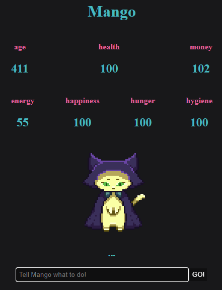

# PET - Mascota Virtual con Django y Pygame

Este es un proyecto de **mascota virtual** desarrollado con **Django** en el backend. El juego simula una mascota que necesita ser alimentada, limpiada, entretenida y cuidada para mantenerse feliz, saludable y viva. El usuario puede interactuar con ella escribiendo instrucciones de texto en una interfaz web estilizada.

---

## Características

* Autenticación de usuarios (registro e inicio de sesión)
* Interacción por texto natural (soporte a múltiples comandos en español e inglés)
* Variables de estado de la mascota: hambre, energía, felicidad, higiene, edad, dinero y salud
* Detección de inactividad para simular el paso del tiempo
* Persistencia de datos en base de datos (SQLite o PostgreSQL)
* Lógica de comandos personalizada con `spaCy` para el procesamiento del lenguaje
* Mensajes de consola que simulan una mini-narrativa

---
 
## Captura de juego 


---

## Comandos soportados

Puedes interactuar con tu mascota escribiendo comandos como:

* `eat`, `alimentar`, `comer`
* `play`, `jugar`
* `clean`, `limpiar`
* `sleep`, `dormir`
* `work`, `trabajar`
* `change name to Firulais`
* `kill kill kill` (comando destructivo)

---

## Tecnologías usadas

* Python 3.10+
* Django
* SQLite (por defecto)
* spaCy (`es_core_news_sm`)
* HTML/CSS para la interfaz web

---

## Instalación y ejecución

1. Clona el repositorio:

```bash
git clone https://github.com/tu_usuario/tu_repo.git
cd tu_repo
```

2. Crea un entorno virtual e instálalo:

```bash
python -m venv venv
.\venv\Scripts\activate   # En Windows
source venv/bin/activate  # En Linux/Mac
```

3. Instala las dependencias:

```bash
python -m spacy download es_core_news_sm
python -m pip install django
```

4. Corre las migraciones:

```bash
python manage.py migrate
```

5. Ejecuta el servidor:

```bash
python manage.py runserver
```

6. Visita [http://localhost:8000](http://localhost:8000) en tu navegador

---

## Notas futuras

> "Hay un error en el que al eliminar un pet, sigue en la base de datos pero a la vez crea otro pet en la base de datos, haciendo un ejercito de pets." — *Alejo del pasado*

---

## Autor

Alejandro Amador
Desarrollador del concepto, lógica del juego y estructura del backend.

---

¡Si te gustó el proyecto, siéntete libre de mejorarlo, reportar errores o dejar una estrella!
